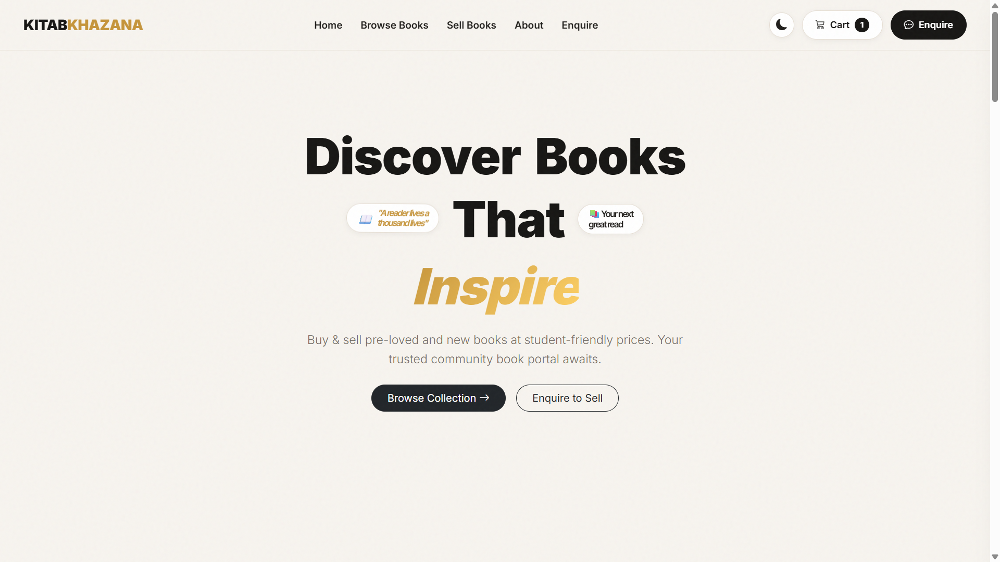
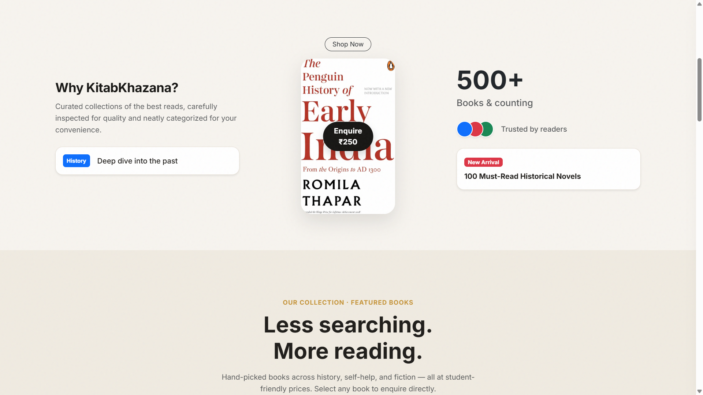
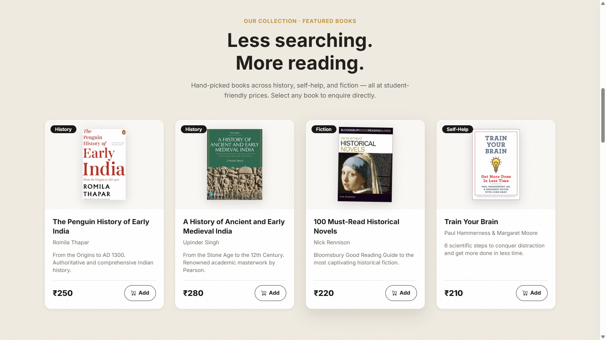
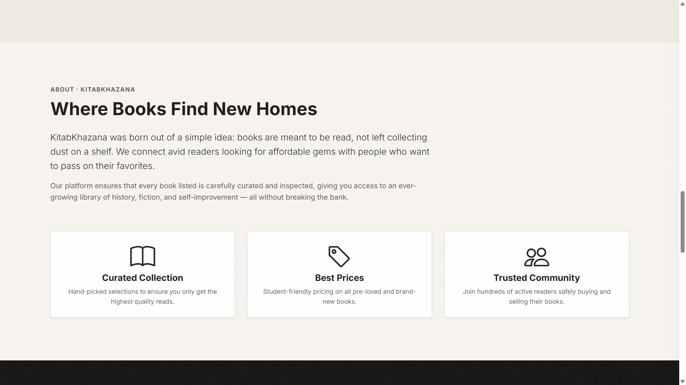
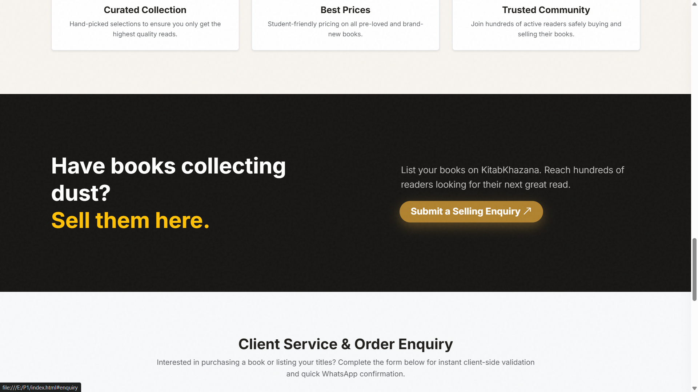
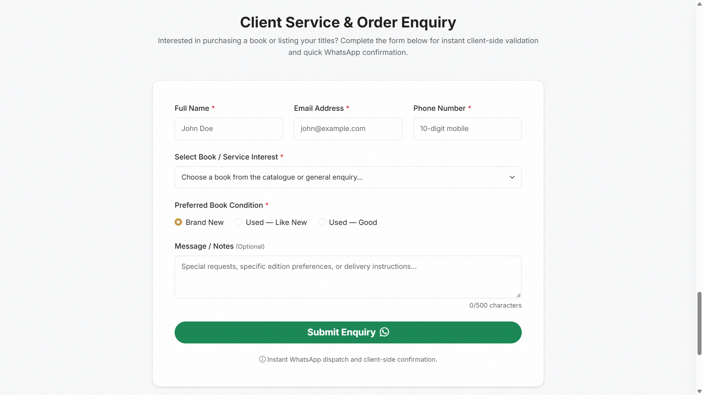
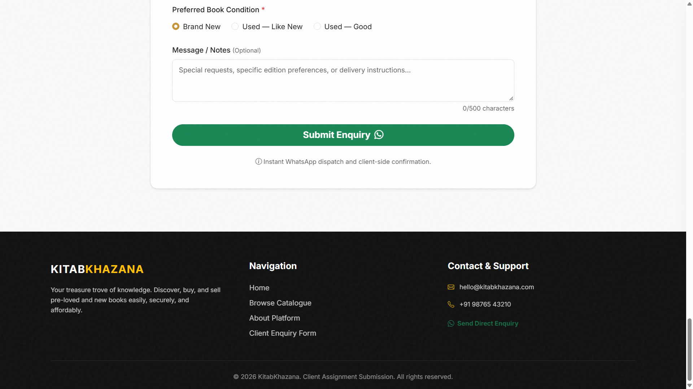
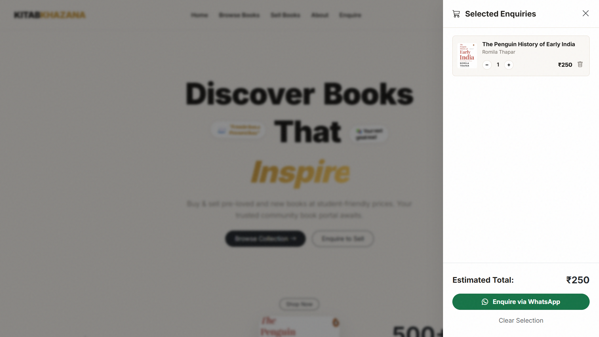
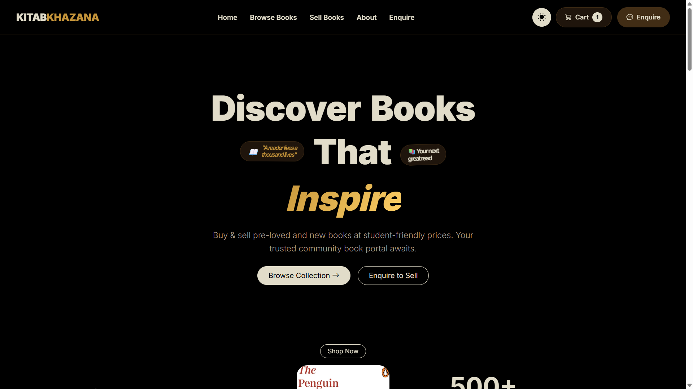

# Kitab-Khazana
An Assignment \ Project 

# 📚 KitabKhazana — Client Enquiry Portal

> *"Treasure of Books"* — a modern, responsive front-end web portal built for a growing book resale & exchange business, so they can finally stop juggling everything over WhatsApp and phone calls.

Built as a client assignment where I took on the role of a **Junior Full-Stack Web Developer** and delivered a real, presentable, working front-end — not a classroom demo. This first version is deliberately scoped to a strong **HTML / CSS / JavaScript** experience; backend and database work is planned for a later phase.

---

## 🧾 The Brief (Client Scenario)

KitabKhazana sources, sells, and exchanges pre-loved and new books across academic history, personal development, and fiction. Before this project, everything ran on informal channels — WhatsApp chats, phone calls, word of mouth — which meant:

- Enquiry details came in inconsistent and incomplete
- The team spent a lot of time going back and forth just to pin down a title, condition, or delivery preference
- There was no central place online that showcased what books were available or why customers should trust the business

So the ask was simple to say and a bit more involved to build: give visitors a clean, responsive site where they can understand the brand, browse what's available, submit a structured enquiry, and get instant feedback — all without a backend, for now.

### Who it's for

| Persona | What they need |
|---|---|
| 🎓 **College Student / Academic** | Affordable textbooks and reference works, quick filtering, clear prices, a fast way to enquire |
| 📖 **Avid Reader / Collector** | Pre-loved novels and rare editions, the ability to specify book *condition* and add custom notes |
| 📦 **Book Seller / Contributor** | A simple way to sell or donate their own books without a complicated merchant sign-up process |

### Goals I designed against

1. **Brand visibility** — make KitabKhazana look like a trustworthy, curated book business, not a garage sale.
2. **Structured lead capture** — turn vague "hey do you have this book?" messages into a clean enquiry with name, validated email, 10-digit phone, book selection, condition, and notes.
3. **Mobile-first, frictionless** — fast loads, no horizontal scrolling, comfortable touch targets, on anything from a phone to a desktop.
4. **Immediate feedback** — real-time validation errors, toasts, and modals so the visitor is never left guessing whether something worked.

---

## 🗺️ Site Map & User Journey

```
index.html
├── Navigation        — brand, section links, theme toggle, live cart counter
├── Hero Banner        — headline, value proposition, primary CTAs
├── Why KitabKhazana    — curation / featured titles / trust badges
├── Catalogue Grid      — books rendered dynamically from a JS data array
├── About Platform      — mission + feature cards
├── Sell CTA            — banner pointing sellers to the enquiry form
├── Client Enquiry Form — validated form, condition radios, char counter
├── Cart / Selection Drawer — multi-book basket → single WhatsApp enquiry
└── Footer              — brand summary, nav, contact, dynamic copyright year
```

A visitor generally goes one of three ways:

- **Browse first** → scans the catalogue → adds a few titles to the selection basket → opens the cart drawer → sends one combined enquiry over WhatsApp.
- **Straight to the point** → jumps to the enquiry form → fills in name, email, phone, picks a title and condition → submits and gets a success modal + WhatsApp message.
- **Wants to sell books** → clicks the "Sell Books" CTA → lands on the same enquiry form to describe what they're offering.

If validation fails anywhere, the form shows an error toast and focuses the invalid field instead of silently failing — nobody should have to guess what went wrong.

---

## 🌐 How the Site Actually Works (Client vs. Server)

Since this phase has no backend, everything happens in the browser:

1. **Request** — the browser sends a `GET` request for `index.html` (or the local file itself).
2. **Response** — the server (or local file system) returns HTML, `styles.css`, `app.js`, and image assets.
3. **DOM + CSSOM** — the browser builds the DOM and CSSOM and merges them into the render tree.
4. **Script execution** — `app.js` takes over: rendering book cards from a `BOOKS` array, wiring up event listeners, reading from `localStorage`, and watching scroll position via `IntersectionObserver`.

```
┌────────────────────────────────────────────────────┐
│                  USER'S BROWSER                    │
│                                                    │
│  [HTML5 DOM] <---> [CSS3 Styling & Grid]           │
│        ^                                           │
│        │ events & dynamic updates                  │
│        v                                           │
│  [Vanilla JavaScript (ES6+)]                       │
│   • Real-time form validation                      │
│   • Dynamic catalogue rendering                    │
│   • DOM manipulation (menu, modals, counters)      │
│   • localStorage (theme, cart, draft enquiry)      │
│   • IntersectionObserver (scroll-triggered motion) │
└────────────────────────────────────────────────────┘
                        │
                        │ wa.me URL scheme
                        v
        ┌───────────────────────────────┐
        │   WhatsApp (structured msg)   │
        └───────────────────────────────┘
```

Everything a visitor does — filtering, validating, saving a draft, adding to cart — happens client-side. The only thing that leaves the browser is the final WhatsApp message, dispatched via a `wa.me` link once the visitor is happy with their enquiry.

---

## 🖼️ Walkthrough (Screenshots)

### 1. Hero Banner
The landing view — headline with a staggered word reveal, floating trust pills ("A reader lives a thousand lives", "Your next great read"), a short value proposition, and two primary CTAs (**Browse Collection** / **Enquire to Sell**). Notice the persistent nav with the theme toggle and a live cart counter already showing `1` item.



### 2. Why KitabKhazana + Featured Book
Scrolling down, a three-column layout introduces the curation pitch, a featured book with an inline "Enquire ₹250" prompt, and quick trust stats (500+ books, reader badges, a "New Arrival" highlight).



### 3. Catalogue Grid
The actual product of the `BOOKS` array — a responsive CSS Grid of book cards, each tagged by category (History, Fiction, Self-Help), with title, author, short blurb, price, and an **Add** button that feeds straight into the cart drawer.



### 4. About Platform
The brand story — "Where Books Find New Homes" — plus a three-card feature grid (Curated Collection, Best Prices, Trusted Community) that reinforces why a visitor should trust the platform.



### 5. Sell CTA
A bold, high-contrast banner aimed squarely at the third persona — people with books to sell — linking directly into the enquiry form's anchor (`#enquiry`), and the start of the **Client Service & Order Enquiry** section.



### 6. Client Enquiry Form
The heart of the lead-capture requirement: Full Name, Email, Phone (with placeholder guidance), a Select menu for book/service interest, radio buttons for condition (Brand New / Used — Like New / Used — Good), and an optional message box with a live character counter (`0/500`).



### 7. Footer
Brand recap, internal navigation links, and contact details (email, phone, a direct WhatsApp enquiry link), plus a dynamically generated copyright year.



### 8. Selection / Cart Drawer
The slide-in basket that powers the "browse first" journey — shows each selected book with quantity controls, a running estimated total, and a single **Enquire via WhatsApp** button that bundles every selected title into one structured message.



### 9. Dark Mode
The same hero section with the theme toggle flipped — because a book portal open at 11pm shouldn't blind anyone. Preference is remembered via `localStorage` so it persists across visits.



---

## ✅ What's Actually Implemented (mapped to the brief)

| # | Requirement | How it shows up here |
|---|---|---|
| 1 | Project planning & architecture | This README + the client/browser diagram above |
| 2 | Semantic HTML structure | Proper `<header>`, `<nav>`, `<section>`, `<footer>`, headings, lists, links, images |
| 3 | Navigation & page structure | Sticky nav with in-page section jumps, logo/text identity, logical flow |
| 4 | Client enquiry form | Text, email, select, radios, and a textarea — all labeled with placeholders and HTML validation attributes |
| 5 | CSS styling system | External stylesheet, reusable classes, consistent tokens for spacing/typography/color |
| 6 | Responsive layout | Mobile-first Flexbox + Grid, no horizontal overflow at any width |
| 7 | UI components | Hero, catalogue cards, feature grid, testimonial-style trust section, form, footer |
| 8 | CSS interaction & motion | Hover states, transitions, scroll-triggered reveals via `IntersectionObserver` |
| 9 | JavaScript fundamentals | Variables, conditionals, loops, and functions used meaningfully throughout `app.js` |
| 10 | Dynamic DOM interaction | Theme toggle, cart drawer, mobile menu, character counter — well over the required two |
| 11 | Form validation | Real-time checks for required fields, email format, and phone length, with inline error states |
| 12 | Client-side storage | `localStorage` remembers theme preference, cart contents, and an in-progress enquiry draft |
| 13 | JS objects & data | The `BOOKS` array (objects with id, title, author, price, category, condition) drives the whole catalogue |
| 14 | Navigation & user flow | Anchor links + JS-assisted scrolling move visitors from "Sell Books" straight into the form |
| 15 | Bootstrap enhancement | Bootstrap grid/utilities and icons layered in without clashing with the custom design system |
| 16 | Responsive presentation | Checked at desktop, tablet, and mobile breakpoints (see screenshots above) |
| 17 | Quality & usability review | Pass for broken links, overflow, alt text, and console errors before submission |
| 18 | Client handover | See the *Handover* section below |

---

## 🛠️ Tech Stack

- **HTML5** — semantic structure
- **CSS3** — custom design system (Flexbox + Grid, no framework lock-in)
- **Vanilla JavaScript (ES6+)** — all interactivity, validation, and dynamic rendering
- **Bootstrap** — layered in for select components, utilities, and icons
- **localStorage** — theme preference, cart state, enquiry draft
- No backend, no database, no build step — open it and it runs

---

## 📁 Project Structure

```
kitabkhazana/
├── index.html          # Main entry point — all sections live here
├── styles.css          # External stylesheet — design tokens, layout, components
├── app.js              # All JavaScript — data, rendering, validation, storage
├── assets/
│   └── images/         # Book covers, icons, and other media
└── screenshots/        # README preview images
```

---

## 🚀 Running It Locally

No installs, no servers, no drama:

1. Clone or download this repository.
2. Open `index.html` directly in any modern browser — **or**, for the best experience (so relative paths and `IntersectionObserver` behave exactly like production), serve it with a lightweight local server:
   ```bash
   npx serve .
   # or
   python3 -m http.server 5500
   ```
3. Navigate to the served address (or just double-click `index.html`) and you're in.

---

## 🤝 Handover Notes

- **HTML/CSS/JS files** all live at the project root as shown in *Project Structure* above — nothing is hidden away in a build pipeline.
- **Book data** lives in a single `BOOKS` array near the top of `app.js` — add, remove, or edit entries there and the catalogue grid re-renders automatically.
- **WhatsApp number** used for the `wa.me` links is set once in `app.js`; update it there if the business contact changes.
- **Theme, cart, and draft enquiry** are all stored under clearly named `localStorage` keys so they're easy to find and clear during testing.
- This is intentionally a **front-end-only** deliverable. The next phase (backend, database, real order persistence) is scoped separately and isn't part of this submission.
